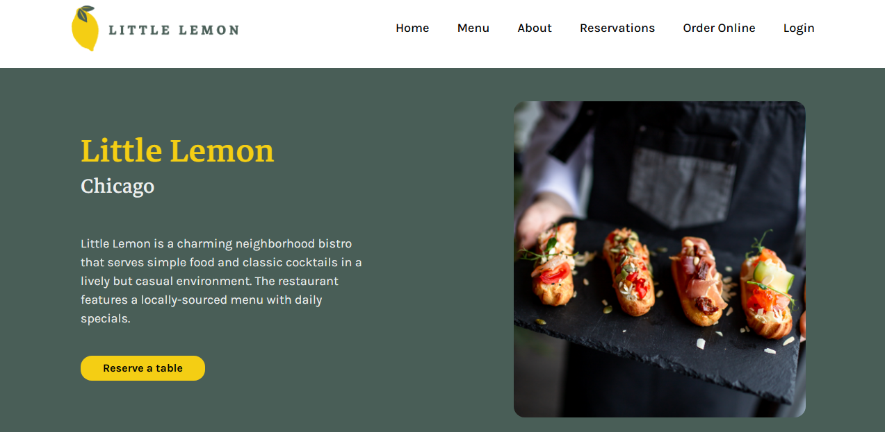

# Little Lemon Restaurant

Welcome to the Little Lemon restaurant web app, designed to make reserving a table a delightful experience!

## Web App interface


## Technologies Used

- **Framework:** React
- **Build Tool:** Vite
- **Styling:** Tailwind CSS, Material UI
- **Icons:** Font Awesome

## Features

- **Seamless Table Reservations:** Users can easily book their tables online.
- **Vibrant and Informative:** Showcases your restaurant's offerings and ambiance.
- **Responsive Design:** Adapts seamlessly to different screen sizes for optimal viewing.

## Getting Started

1. **Clone the repository:**

   ```bash
   git clone https://github.com/umairulislam/CapstoneProject-Meta.git
   ```

2. **Install dependencies:**

   ```bash
   cd CapstoneProject-Meta
   npm install
   ```

3. **Start the development server:**

   ```bash
   npm run dev
   ```

4. **Access the app in your browser:**

   Typically at `http://localhost:5173/`

## Additional Information

- **Design to Code:** The app's visual design was meticulously crafted in Figma and then transformed into functional code.

